# System Scalability: Building Systems that Grow 📈

**Note designed for:** Backend developers who want to design and implement scalable systems that handle growth efficiently.

---

## 📹 Topic Coverage Map

✅ **Topics Covered:**
- Vertical Scaling (Scale Up)
- Horizontal Scaling (Scale Out)
- Caching Strategies
- Load Balancing Techniques
- Database Replication
- Database Partitioning (Sharding)

---

## 0. Before You Begin: Prerequisites 🎯

**What you should know:**
- Basic understanding of client-server architecture
- Familiarity with databases (SQL/NoSQL)
- Basic networking concepts (HTTP, TCP/IP)

---

## 1. Topic Overview & The "Elevator Pitch" 🚀

**Scalability** is the capability of a system to handle increased load by adding resources without compromising performance or requiring fundamental architectural changes.

In modern backend development, scalability isn't optional—it's essential. As your user base grows from hundreds to millions, your system must adapt without breaking. Scalability strategies determine whether your application thrives during a viral surge or crashes under pressure. These techniques—from scaling servers vertically or horizontally to implementing caching, load balancing, and database optimization—form the foundation of robust, production-ready systems.

**Key Takeaway:** Scalability is about building systems that grow gracefully with demand, using strategic resource allocation and architectural patterns to maintain performance at any scale.

---

## 1.5. Why Should You Care? 💡

**What problem does this solve?**

Imagine launching a successful product that goes viral overnight. Without scalability, your servers crash at 10,000 users when you have 100,000 trying to connect. You lose customers, revenue, and reputation. Twitter's "fail whale" during early growth became infamous because they struggled with scale.

**Compelling statistic:** Amazon found that every 100ms of latency costs them 1% in sales. Google discovered that increasing search results time by just 0.5 seconds dropped traffic by 20%. When Instagram scaled from 0 to 14 million users in one year, their scalability decisions determined their survival.

**Your pain point:** As a backend developer, you'll face the "success problem"—your app works perfectly for 1,000 users but collapses at 10,000. Learning scalability prevents career-defining outages and positions you as someone who builds for growth, not just for launch.

---

## 2. The Big Picture: An Analogy or Metaphor 🧠

Think of scalability like **managing a restaurant during different crowd sizes**.

**Vertical Scaling** is like hiring a super-chef who can cook 10x faster—you make your one kitchen more powerful. It's quick but has limits (even the best chef has maximum capacity).

**Horizontal Scaling** is like opening multiple restaurant locations—instead of one super-kitchen, you have many regular kitchens working together. More complex to coordinate, but theoretically unlimited.

**Load Balancing** is the host who distributes customers evenly across tables—ensuring no single waiter is overwhelmed while others stand idle.

**Caching** is like having popular dishes pre-made and ready to serve instantly, instead of cooking from scratch every time.

**Database Replication** is like having backup recipe books—if one gets damaged, you have copies. Some books (read replicas) are only for reference, while the master book gets all the new recipes.

**Database Partitioning** is like organizing recipes by cuisine type into separate books—Italian dishes in one book, Chinese in another—making it faster to find specific recipes.

### Explain it to a 5-year-old

Scalability is like having a lemonade stand. When more friends come to buy lemonade, you have two choices: you can squeeze lemons faster (get better at making lemonade), or you can ask your friends to help you by opening more lemonade stands. You also keep some lemonade already made so you don't have to squeeze every time someone asks!

---

## 3. Key Concepts & Definitions (The Building Blocks) 🧱

| Term | Simple Explanation |
|------|-------------------|
| **Vertical Scaling** | Adding more power (CPU, RAM) to existing servers—scaling "up" by making machines stronger |
| **Horizontal Scaling** | Adding more servers to distribute the load—scaling "out" by adding more machines |
| **Caching** | Storing frequently accessed data in fast memory to avoid repeated expensive operations |
| **Load Balancing** | Distributing incoming requests evenly across multiple servers to prevent overload |
| **Database Replication** | Creating copies of your database across multiple servers for reliability and read performance |
| **Database Partitioning** | Splitting database data across multiple databases to distribute load and improve query speed |

---

## 3.5. Memory Aids & Mnemonics 🧠

**"VHCLRP" - "Very Happy Customers Love Reliable Products"**

- **V**ertical scaling = Power UP one machine
- **H**orizontal scaling = Add MORE machines
- **C**aching = Remember frequently used data
- **L**oad balancing = Distribute traffic evenly
- **R**eplication = Copy data for safety
- **P**artitioning = Split data for speed

**Mini-Story:** 
Imagine you're building a tower (vertical scaling) but it can only go so high. So you build multiple towers side by side (horizontal scaling). You need a traffic controller (load balancer) to direct people to the right tower. You install fast elevators (cache) in each tower so people don't always take the stairs. Each tower has backup blueprints (replication), and different towers handle different departments (partitioning).

---

## 4. Detailed Explanation (The Deep Dive) 🏊

### 4.1 Vertical Scaling (Scale Up)

**What it is:** Upgrading your existing server hardware—more CPU cores, more RAM, faster disks, better network cards.

**How it works:**
- Start with a server that has 4 CPU cores and 16GB RAM
- Upgrade to 16 cores and 128GB RAM
- Your application code doesn't change
- One machine handles more concurrent requests

**Advantages:**
- Simple to implement—no code changes needed
- No complexity in data consistency (single source of truth)
- Easy to reason about—one database, one server
- Lower software licensing costs (some licenses are per-server)

**Disadvantages:**
- **Hard limits:** Physical hardware has maximum capacity
- **Single point of failure:** If this server dies, everything stops
- **Expensive:** High-end servers cost exponentially more
- **Downtime required:** Usually need to shut down to upgrade hardware
- **Diminishing returns:** 2x the hardware ≠ 2x the performance

**When to use:** Early-stage applications, databases that require ACID guarantees, when operational simplicity matters more than infinite scale.

⏸️ **Pause & Process**: Think about your current project. If it suddenly got 10x traffic tomorrow, could you simply upgrade the server? Or would you hit limits?

---

### 4.2 Horizontal Scaling (Scale Out)

**What it is:** Adding more servers to work together as a cluster, distributing workload across multiple machines.

**How it works:**
- Start with 1 web server
- Add 2 more identical web servers (now you have 3)
- Incoming requests are distributed across all 3
- Each server runs the same application code
- Add more servers as needed

**Advantages:**
- **Near-infinite scalability:** Just add more machines
- **Fault tolerance:** If one server fails, others continue working
- **Cost-effective:** Use commodity hardware instead of expensive high-end servers
- **No downtime:** Add/remove servers while system runs
- **Geographic distribution:** Servers in different regions for lower latency

**Disadvantages:**
- **Complexity:** Need load balancers, session management, distributed systems knowledge
- **Data consistency challenges:** Multiple servers need synchronized state
- **More moving parts:** More servers = more things that can fail
- **Network latency:** Communication between servers adds overhead

**Implementation requirements:**
- Stateless applications (session data in external store like Redis)
- Load balancer in front of servers
- Shared database or distributed data strategy
- Health checks and auto-scaling policies

**When to use:** Web applications expecting high traffic, microservices architectures, when fault tolerance is critical, cloud-native applications.

---

### 4.3 Caching

**What it is:** Storing copies of frequently accessed data in fast-access memory to avoid expensive computations or database queries.

**How it works:**
1. Request comes in for data
2. Check cache first (cache hit = return immediately)
3. If not in cache (cache miss), fetch from database
4. Store result in cache for next time
5. Subsequent requests are served from cache (fast!)

**Cache Levels:**
- **Client-side:** Browser cache (HTTP headers)
- **CDN:** Content Delivery Network for static assets
- **Application cache:** In-memory cache (Redis, Memcached)
- **Database cache:** Query result cache

**Common caching strategies:**

1. **Cache-Aside (Lazy Loading):**
   - Application checks cache before database
   - On miss, fetch from DB and populate cache
   - Good for read-heavy workloads

2. **Write-Through:**
   - Write to cache and database simultaneously
   - Cache always consistent with database
   - Slower writes, but guaranteed consistency

3. **Write-Behind (Write-Back):**
   - Write to cache immediately
   - Asynchronously write to database later
   - Fast writes, but risk of data loss

4. **Read-Through:**
   - Cache sits between application and database
   - Cache automatically populates itself on miss
   - Simplifies application code

**Cache Invalidation (the hard part):**
- **Time-based (TTL):** Data expires after X seconds
- **Event-based:** Invalidate cache when data changes
- **Manual:** Explicit cache clear on updates

**Popular tools:** Redis, Memcached, Varnish, CDNs (CloudFlare, Akazon CloudFront)

⏸️ **Pause & Process**: Cache invalidation is famously one of the "two hard problems in computer science" (along with naming things). The challenge is keeping cached data synchronized with the source of truth.

---

### 4.4 Load Balancing

**What it is:** A traffic cop that distributes incoming requests across multiple servers to prevent any single server from being overwhelmed.

**How it works:**


```mermaid
graph LR
    Client[👤 Client Request] --> LB[⚖️ Load Balancer]
    LB --> Server1[🖥️ Server 1]
    LB --> Server2[🖥️ Server 2]
    LB --> Server3[🖥️ Server 3]
    
    style Client fill:#e1f5ff
    style LB fill:#fff4e1
    style Server1 fill:#e1ffe1
    style Server2 fill:#e1ffe1
    style Server3 fill:#e1ffe1
```

**Load Balancing Algorithms:**

1. **Round Robin:**
   - Requests distributed sequentially (1→2→3→1→2→3...)
   - Simple and fair
   - Doesn't account for server load or capacity

2. **Least Connections:**
   - Send request to server with fewest active connections
   - Better for long-lived connections
   - Accounts for varying request processing times

3. **Weighted Round Robin:**
   - Servers assigned weights based on capacity
   - Powerful server gets 2x traffic of weak server
   - Good when servers have different specs

4. **IP Hash:**
   - Hash client IP to determine server
   - Same client always goes to same server (session affinity)
   - Useful for stateful applications

5. **Least Response Time:**
   - Send to server with fastest response time
   - Optimizes for user experience
   - Requires health check monitoring

**Types of Load Balancers:**

- **Layer 4 (Transport Layer):** TCP/UDP level, fast but basic
- **Layer 7 (Application Layer):** HTTP level, can route based on URL, headers, cookies

**Health Checks:**
- Load balancer pings servers regularly
- Unhealthy servers removed from rotation
- Automatic recovery when server becomes healthy

**Popular tools:** Nginx, HAProxy, AWS ELB, Google Cloud Load Balancer, Azure Load Balancer

---

### 4.5 Database Replication

**What it is:** Creating and maintaining copies of your database across multiple servers for redundancy and performance.

**Architecture Patterns:**

**1. Master-Slave (Primary-Replica):**

```mermaid
graph TB
    Master[(💾 Master DB<br/>Writes)]
    Replica1[(📖 Replica 1<br/>Reads)]
    Replica2[(📖 Replica 2<br/>Reads)]
    Replica3[(📖 Replica 3<br/>Reads)]
    
    Master -.->|Replicates Data| Replica1
    Master -.->|Replicates Data| Replica2
    Master -.->|Replicates Data| Replica3
    
    style Master fill:#e1ffe1
    style Replica1 fill:#f0ffe1
    style Replica2 fill:#f0ffe1
    style Replica3 fill:#f0ffe1
```

- One master handles all writes
- Slaves replicate master's data
- Slaves handle read queries
- Reduces read load on master

**2. Master-Master (Multi-Master):**

```mermaid
graph LR
    Master1[(💾 Master 1<br/>Read/Write)]
    Master2[(💾 Master 2<br/>Read/Write)]
    
    Master1 <-.->|Bi-directional Sync| Master2
    
    style Master1 fill:#e1ffe1
    style Master2 fill:#e1ffe1
```

- Multiple masters can accept writes
- Masters sync with each other
- Complex conflict resolution
- Higher availability but tricky consistency

**Replication Types:**

**Synchronous Replication:**
- Master waits for replica to confirm write
- Guaranteed consistency
- Slower writes (network latency)
- Strong consistency guarantee

**Asynchronous Replication:**
- Master doesn't wait for replica
- Fast writes
- Eventual consistency (replica might lag)
- Risk: failover might lose recent writes

**Benefits:**
- **Improved read performance:** Distribute read queries across replicas
- **High availability:** Failover to replica if master fails
- **Disaster recovery:** Geographic replication for backup
- **Analytics:** Run heavy reports on replica without affecting production

**Challenges:**
- **Replication lag:** Replica data slightly behind master
- **Complexity:** Need to route reads vs writes correctly
- **Failover logic:** Promoting replica to master requires coordination
- **Data conflicts:** In multi-master, conflicting writes need resolution

---

### 4.6 Database Partitioning (Sharding)

**What it is:** Splitting your database into smaller, independent pieces (shards) distributed across multiple servers, with each shard containing a subset of the data.

**How it works:**
Instead of one massive database, you have:
- Shard 1: Users with IDs 1-1,000,000
- Shard 2: Users with IDs 1,000,001-2,000,000
- Shard 3: Users with IDs 2,000,001-3,000,000

**Sharding Strategies:**

**1. Range-Based Sharding:**
- Split data by value ranges (user ID 1-1M, 1M-2M, etc.)
- Simple to implement
- Risk of uneven distribution (hotspots)

**2. Hash-Based Sharding:**
- Hash the shard key (e.g., user_id % number_of_shards)
- Even distribution
- Hard to add shards later (rehashing needed)

**3. Geographic Sharding:**
- Shard by location (US users, EU users, Asia users)
- Low latency for local users
- May have uneven distribution

**4. Directory-Based Sharding:**
- Lookup table maps keys to shards
- Flexible but adds complexity
- Lookup table becomes bottleneck

**Benefits:**
- **Horizontal scalability for databases:** Break through single-server limits
- **Improved query performance:** Smaller datasets = faster queries
- **Reduced cost:** Distribute across cheaper servers
- **Parallel processing:** Query multiple shards simultaneously

**Challenges:**
- **Complex queries:** Joins across shards are expensive
- **Rebalancing:** Moving data between shards is difficult
- **Shard key selection:** Wrong key = uneven distribution
- **Application complexity:** App must know which shard to query
- **Transactions:** Cross-shard transactions extremely difficult

**When to use:** When single database can't handle data volume, when you've exhausted vertical scaling, when you need geographic distribution.

⏸️ **Pause & Process**: Sharding is a one-way door—it's hard to undo. Consider it carefully and exhaust other options (caching, read replicas, optimization) first.

---

## 5. Visualizing the Process: Mermaid Diagram 📊

```mermaid
graph TB
    Client[👤 Client Requests]
    LB[⚖️ Load Balancer]
    Cache[⚡ Cache Layer<br/>Redis/Memcached]
    
    Server1[🖥️ Web Server 1]
    Server2[🖥️ Web Server 2]
    Server3[🖥️ Web Server 3]
    
    Master[(💾 Master DB<br/>Writes)]
    Replica1[(📖 Replica 1<br/>Reads)]
    Replica2[(📖 Replica 2<br/>Reads)]
    
    Shard1[(🗄️ Shard 1<br/>Users 1-1M)]
    Shard2[(🗄️ Shard 2<br/>Users 1M-2M)]
    Shard3[(🗄️ Shard 3<br/>Users 2M-3M)]
    
    Client -->|Request| LB
    LB -->|Distribute| Server1
    LB -->|Distribute| Server2
    LB -->|Distribute| Server3
    
    Server1 -.->|Check Cache| Cache
    Server2 -.->|Check Cache| Cache
    Server3 -.->|Check Cache| Cache
    
    Server1 -->|Write| Master
    Server2 -->|Write| Master
    Server3 -->|Write| Master
    
    Server1 -->|Read| Replica1
    Server2 -->|Read| Replica2
    Server3 -->|Read| Replica1
    
    Master -.->|Replicate| Replica1
    Master -.->|Replicate| Replica2
    
    Server1 -->|Query Specific Shard| Shard1
    Server2 -->|Query Specific Shard| Shard2
    Server3 -->|Query Specific Shard| Shard3
    
    style Client fill:#e1f5ff
    style LB fill:#fff4e1
    style Cache fill:#ffe1e1
    style Master fill:#e1ffe1
    style Replica1 fill:#f0ffe1
    style Replica2 fill:#f0ffe1
```



**Diagram explanation:** This visualizes a complete scalable architecture. Client requests hit the load balancer, which distributes traffic across multiple horizontally scaled web servers. Each server first checks the cache for fast responses. For database operations, writes go to the master database, while reads are distributed across replicas. For massive scale, data is partitioned across shards, with each server querying the appropriate shard based on the data key.

---

## 6. Practical Example or Case Study 💡

### Real-World Scenario: Scaling a Social Media API

**Initial Architecture (1,000 users):**
- Single EC2 instance (4 cores, 16GB RAM) - vertical scaling
- Single PostgreSQL database on same server
- Response time: 50ms average

**Problem at 50,000 users:**
- Server CPU at 95% constantly
- Database queries slow (500ms+)
- Frequent timeouts during peak hours

**Solution Implementation:**

**Step 1: Add Caching (Quick Win)**
```
Deploy Redis cache
Cache user profiles (TTL: 5 minutes)
Cache feed data (TTL: 30 seconds)
Result: 70% of reads served from cache, response time down to 80ms
```

**Step 2: Horizontal Scaling for Web Servers**
```
Deploy 3 identical web servers
Add AWS Application Load Balancer
Configure health checks
Result: Can handle 3x traffic, redundancy achieved
```

**Step 3: Database Replication**
```
Setup master-slave replication
Master: handles all writes
2 read replicas: handle all read queries
Application routes reads to replicas, writes to master
Result: Database CPU from 90% to 30%, query times under 50ms
```

**Step 4: Vertical Scaling for Database (when needed)**
```
Upgrade master DB server: 8 cores → 16 cores, 32GB → 128GB RAM
Result: Can handle write load for 500,000 users
```

**Future: Sharding (when hitting 1M+ users)**
```
Shard by user_id hash
Shard 1: user_id % 4 == 0
Shard 2: user_id % 4 == 1
Shard 3: user_id % 4 == 2
Shard 4: user_id % 4 == 3
Result: Distributed write load, sub-100ms response times maintained
```

**Final Architecture Stats:**
- 3 web servers (horizontal)
- 1 load balancer
- Redis cache cluster
- 1 master database (vertically scaled)
- 4 read replicas (replication)
- 4 database shards (partitioning)
- Handles 1M+ users with 99.9% uptime

**Key Insight:** They didn't implement everything at once. They scaled incrementally based on actual bottlenecks, measuring each step's impact.

---

## 7. Check Your Understanding (Active Recall Questions) ❓

1. **Retrieval:** What are the key differences between vertical and horizontal scaling, and what are the hard limits of each approach?

2. **Application:** You're building a news website that gets massive traffic spikes when breaking news hits. The database queries for article content are slow, but each article doesn't change once published. Which scalability techniques would you apply first and why? Describe your implementation strategy.

3. **Connection:** How do caching and database replication relate to each other? In what scenarios might you use one, the other, or both together? What are the trade-offs in consistency?

---

## 8. Summary & Key Takeaways (The Revision Card) 📌

- **Vertical Scaling**: Upgrade hardware (more power to one machine). Simple but has hard limits. Good for early-stage apps.

- **Horizontal Scaling**: Add more servers. Infinite scalability but requires stateless architecture, load balancers, and distributed system complexity.

- **Caching**: Store frequently accessed data in fast memory (Redis/Memcached). Provides 10-100x performance boost but introduces cache invalidation challenges.

- **Load Balancing**: Distributes traffic across servers using algorithms (round robin, least connections, etc.). Essential for horizontal scaling and high availability.

- **Database Replication**: Copy data across multiple databases. Master handles writes, replicas handle reads. Improves read performance and provides redundancy.

- **Database Partitioning (Sharding)**: Split data across multiple databases. Breaks through single-database limits but adds significant complexity. Use as last resort after exhausting other options.

---

## 9. Potential Pitfalls & Common Misconceptions ⚠️

**Misconception #1: "More servers = better performance"**
- **Reality**: Adding servers without addressing bottlenecks wastes money. If your database is the bottleneck, adding 10 more web servers won't help. Always identify the actual constraint first.

**Misconception #2: "Caching solves everything"**
- **Reality**: Cache invalidation is notoriously difficult. Stale cache data can cause bugs, inconsistencies, and wrong business logic. Caching adds complexity and isn't always the right solution.

**Red Flags:**
- 🚩 Sharding before trying caching, read replicas, and query optimization
- 🚩 Horizontal scaling without making application stateless first
- 🚩 No monitoring/metrics when scaling (you're flying blind)
- 🚩 Premature optimization—scaling before you have real traffic data
- 🚩 Ignoring single points of failure (one load balancer, one cache server)

**Anti-Pattern Example:**
```
BAD: Implementing complex sharding for 1,000 users
- Massive engineering effort
- Months of development
- Complex codebase maintenance
- Overkill for current scale

GOOD: Start simple, scale incrementally
- Use single database initially
- Add caching when needed
- Add read replicas when writes become bottleneck
- Shard only when you've exhausted other options
```

**Why it fails**: Over-engineering for scale you don't have yet wastes resources and creates unnecessary complexity. Scale based on actual metrics and bottlenecks, not theoretical future load.

---

## 10. The Underlying Pattern 🎯

**Universal principle**: **"Add resources where constraints exist, eliminate work where possible"**

This is an example of **resource optimization and constraint theory**. In any system (computing, manufacturing, logistics), performance is limited by the slowest component (the bottleneck). Scalability strategies either:
1. Add resources to the bottleneck (scaling)
2. Reduce work at the bottleneck (caching, optimization)
3. Distribute work around the bottleneck (load balancing, replication)

**This pattern appears in:**
- **Manufacturing**: Adding production lines (horizontal), faster machines (vertical), inventory (caching)
- **Transportation**: More lanes on highways (horizontal), faster vehicles (vertical), carpooling (load balancing)
- **Biology**: Cell division (horizontal scaling), larger cells (vertical scaling), ATP storage (caching)
- **Business**: Hiring more employees (horizontal), training experts (vertical), delegation (load balancing)

**Key insight**: The best scalability strategy isn't always "add more resources"—sometimes it's "reduce unnecessary work" (like caching) or "distribute work better" (like load balancing). Elegant systems scale by being smarter, not just bigger.

---

## 10.5. Connections & Further Learning 🌐

**Related Concepts:**

1. **Microservices Architecture**: Horizontal scaling taken to the logical extreme—breaking applications into small, independently scalable services. Each service can scale independently based on its specific load patterns.

2. **CAP Theorem**: When you scale horizontally with distributed databases, you face the fundamental trade-off between Consistency, Availability, and Partition tolerance. You can only guarantee two of three. Understanding CAP helps you make informed decisions about replication and partitioning.

3. **Event-Driven Architecture**: Asynchronous processing through message queues (like RabbitMQ, Kafka) is another scalability strategy. Instead of processing requests synchronously, you queue them for asynchronous processing, allowing horizontal scaling of both producers and consumers.

**Further Reading:**
- [Scalability Patterns](https://www.microsoft.com/en-us/research/publication/scalability-patterns/) - Microsoft Research
- [High Scalability Blog](http://highscalability.com/) - Real-world architecture case studies
- [AWS Well-Architected Framework](https://aws.amazon.com/architecture/well-architected/) - Best practices for scalable cloud systems

---

## 11. Sources 📚

- Provided video source: [Scalability Fundamentals](https://www.youtube.com/watch?v=-W9F__D3oY4)
- [System Design Primer - Scalability](https://github.com/donnemartin/system-design-primer#scalability) - Comprehensive open-source guide
- [AWS Database Scaling Strategies](https://aws.amazon.com/blogs/database/) - Official AWS documentation
- [Martin Kleppmann - Designing Data-Intensive Applications](https://dataintensive.net/) - Industry standard textbook on distributed systems

---

**Remember**: Scalability isn't about implementing every technique at once—it's about identifying bottlenecks through measurement and applying the right solution at the right time. Start simple, measure everything, scale incrementally. 🚀
